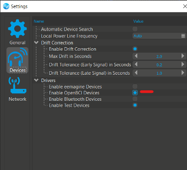
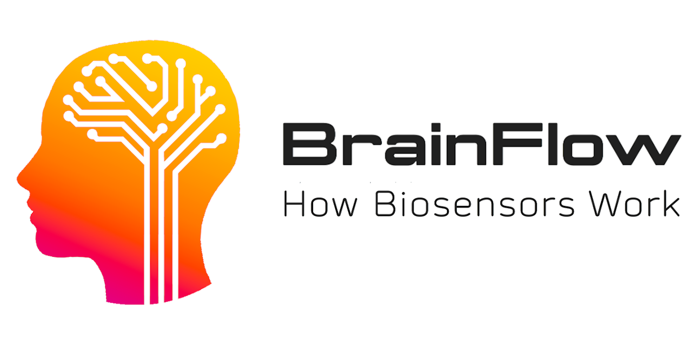
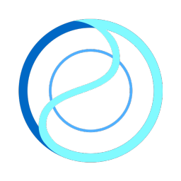
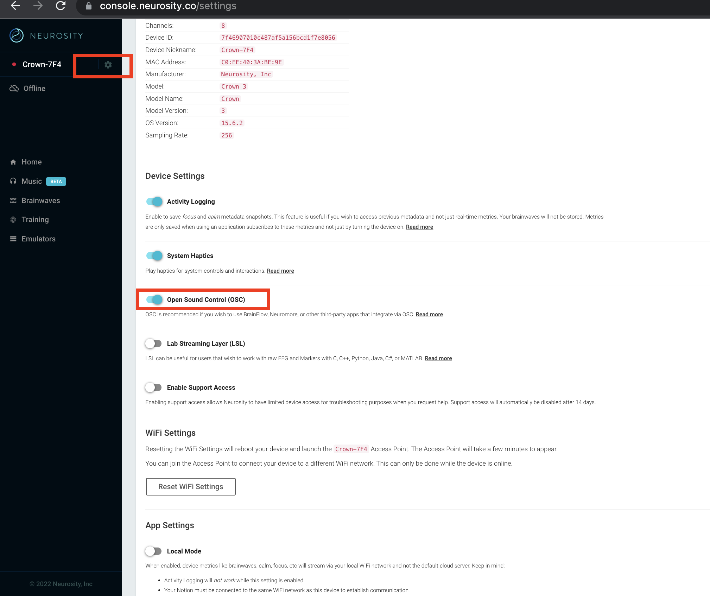
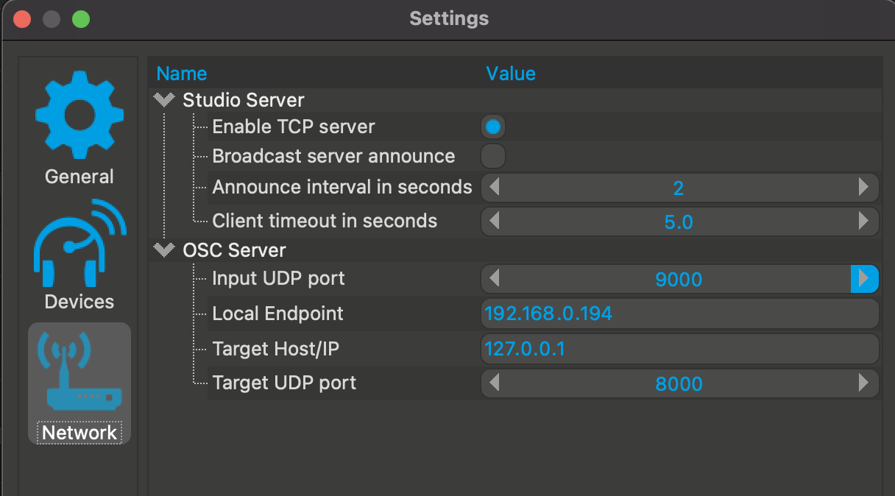
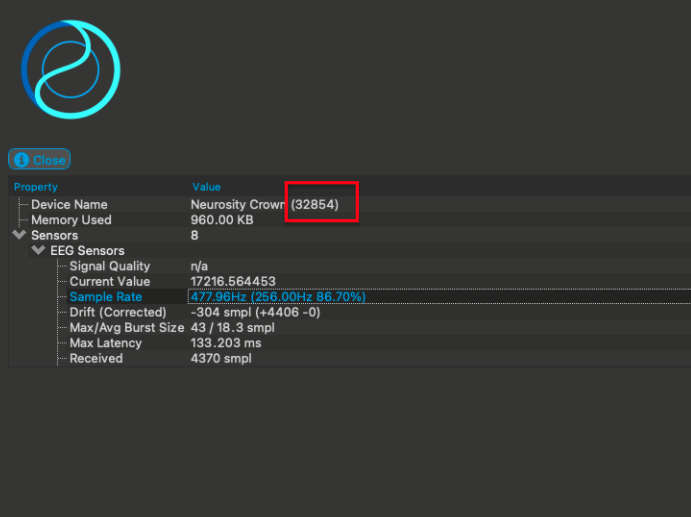
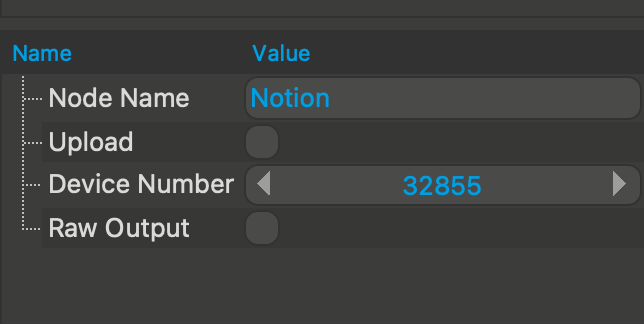

#OpenBCI

- Platforms: Windows, OSX
- Devices: OpenBCI 8/32-bit 8 channels (without Daisy module)

Before connecting your board go to the Settings (on Windows: _Edit>Settings>Devices_, on MacOS: _NMStudio>Settings>Devices_) and make sure that _Enable OpenBCI Devices_ is selected.
Then connect your OpenBCI board to your computer. Make sure to take the following steps before using it with neuromore Studio:

_Windows_: Make sure your board is recognized as a COM port and that its latency is set to 1 ms. To troubleshoot, read the [OpenBCI on Windows tutorial on their official site](https://docs.openbci.com/Troubleshooting/FTDI_Fix_Windows/).

_Mac OS_: Make sure your board is connected and visible as a device. To check you can type `ls /dev/tty.*` on your terminal. An example connected OBCI board should look like this:

`neuromore-MacBook:~ neuromore$ ls /dev/tty.* /dev/tty.OpenBCI-DN00959R`

To troubleshoot, visit OpenBCI's [FTDI buffer fix for MacOS site](https://docs.openbci.com/Troubleshooting/FTDI_Fix_Mac/).

#InteraXon Muse

- Platforms: Windows, OSX
- Devices: Standard Muse (model MU-01) with the default preset

##Using a Muse on Windows

Connecting a Muse to the Studio is easy:

1.  Make sure your Muse is paired to your PC, is turned on and in reach of the receiver
2.  Press 'Tools'->'Start Muse IO' in neuromore Studio menu to start the data aquisition program
3.  The Muse will automatically appear in neuromore Studio once the connection is established

Please note that neuromore Studio doesn't work with the official Muse IO software because it outputs the data to the wrong OSC addresses. Instead we ship it with a fixed version that was provided to us by InteraXon (thanks Tom!). You can find the executable in the folder _Muse_ inside the installation directory.

##Using a Muse on OSX

A few steps are necessary to get the Muse to work on OSX:

1.  Download the Muse IO application [from here](https://sites.google.com/a/interaxon.ca/muse-developer-site/museio)
2.  Extract the application to a folder (for example your home folder)
3.  Make sure your Muse is paired to your Mac, switched on and in reach of the receiver
4.  Press 'Tools'->'Start Muse IO' in the neuromore Studio menu and choose the Muse IO application from the folder where you extracted it
5.  The data aquisition window will pop up. Keep it running while you stream data and check it for any connection errors that might appear
6.  The Muse will automatically appear in neuromore Studio once the connection is established

#Brainflow

- Platforms: Windows, MacOS, Linux
- Devices:
  - [OpenBCI](https://openbci.com/) Cyton, Ganglion, Daisy, Galea, Cyton WIFI, Ganglion WIFI & Daisy WIFI
  - [Brainbit EEG](https://brainbit.com/?gclid=Cj0KCQjw1ZeUBhDyARIsAOzAqQKLEdjZaoNE1iQWmrtR6HIyRxtxCdnkIePywI3daevRkn74qz5S760aAuifEALw_wcB)
  - [G.TEC Unicorn](https://www.unicorn-bi.com/)
  - [Callibri](https://callibri.com/) EEG, EMG, ECG
  - [Neurosity](https://neurosity.co/) Notion & Notion2 (Crown coming soon)
  - [Oymotion](http://www.oymotion.com/en/product32/149) GForcePro EMG Armband
  - [FreeEEG32 board](https://www.crowdsupply.com/neuroidss/freeeeg32)
  - [Brainflow Playback, Streaming & Synthetic board](https://brainflow.readthedocs.io/en/stable/SupportedBoards.html#brainflow-dummy-boards)

Brainflow is a great library integrating a variety of different biosensors with APIs for different programming languages.
Thanks to [Andrey](https://github.com/Andrey1994)'s amazing integration, neuromore Studio allows you to use all of those sensors as well to build your application through its no-code visual interface.

To use a biosensor using Brainflow, you will have to set the board_id, the serial_port, and sometimes the mac_address or the ip_address/ ip_port fields.
Please have a look at [their documentation](https://brainflow.readthedocs.io/en/stable/SupportedBoards.html) to find these parameters.

#Neurosity

- Platforms: Windows, MacOS, Linux
- Devices: Notion, Notion2 (Crown coming soon)

To use Neurosity devices with neuromore Studio, you'll have to prepare a few steps:

##Enabling OSC in the Neurosity developer console
You'll have to enable OSC support in the Neurosity developer console.

1. In case you don't have a Neurosity dev account yet, follow [this short guide](https://support.neurosity.co/hc/en-us/articles/360036196792-Create-account-with-Neurosity) to set up your account.
2. Go to your device settings in to the [developer console](https://console.neurosity.co/settings) and enable OSC.
   

##Connecting your device in neuromore Studio

1. Go to the Network Settings (go to _Edit>Settings>Network_ (Windows) or _NMStudio>Settings>Network_ (MacOS)) and set the Input UDP port to 9000. This is necessary as the Notion devices stream their data through OSC to the Studio.
   

2. Make sure the device is on the same WIFI network as your computer.
3. Start the device, go to the "Devices" window and click on the search icon (if it is not automatically recognized)
4. Find the device ID in the "Devices" window in neuromore Studio.
   
5. Set the "Device Number" of the Neurosity node in the classifer to the device ID incremented by 1 (e.g. if the device ID is 33285 set it to 33286 in the classifier).
   
   Note: at the moment we still experience a drift when streaming from Neurosity devices which means that the signal might not be consistently streamed. We are working on a fix for that at the moment with the Neurosity team.

#NeuroSky

- Platforms: Windows
- Devices: MindWave (model MW003)

1.  If you have never connected a MindWave before you must first enable the driver in the settings once (see image).
2.  Make sure your device is paired to your PC, is turned on and in reach of the receiver
3.  The MindWave will automatically appear in neuromore Studio once the connection is established

#Emotiv EPOC / EPOC+

- Platforms: Windows
- Devices: EPOC, EPOC+

Plug in your dongle and turn on the device either before you start or while neuromore Studio is running. Connected devices will be detected automatically and shown in the interface.

#Emotiv Insight

- Devices: Insight with Emotiv Receiver Dongle

Please be aware that the Emotiv Insight has [known issues](https://emotiv.zendesk.com/hc/en-us/articles/204819169-Bluetooth-Connectivity-Issues) regarding Bluetooth LE connectivity and might not work correctly even if the operating system and USB receiver adhere to the standard. We found that the best solution is to use the [Emotiv USB Receivers](https://emotiv.com/store/product_9.html) (requires one receiver per device). This is the same receiver used by the Epoc+.

Plug in your dongle and turn on your Insight. Feel free to open neuromore Studio before plugging in the dongle or turning on the Insight. It will work both ways and the device will be automatically shown in the interface once the connection is established.

#SenseLabs Versus

- Platforms: Windows
- Devices: Versus (non-BTLE version)

Important: We do not support the consumer Bluetooth LE version of the Versus that is sold on their website right now. neuromore Studio only supports the version that comes with a standard Bluetooth interface. Please contact [SenseLabs](https://senselabs.com) for further information on how to buy this research edition of the Versus.

##Setting up the Versus

It is very important that you follow this setup procedure the first time you connect your Versus to a Windows PC. If you don't do this it will break your device and you will have to reset it (described below).

1.  Pair the Versus with your Windows PC
2.  Make sure neuromore Studio (or any other software that could access the device) is **not running**
3.  Open the _Devices and Printers_ Windows Control Panel
4.  Right click on your Versus device and select _Properties_. A window will pop up.
5.  Disable the _Wireless iAP_ service under the tab _Services_.

**Resetting the Versus**
If you started an application that accessed the Versus _before_ you disabled the iAP bluetooth service you will have to reset device:

1.  Turn off the Versus.
2.  Turn it on again but don't release the button.
3.  Keep the button pressed until the LED blinks red. The device is now reset.

#Advanced Brain Monitoring B-Alert X-Series

- Platforms: Windows
- Devices: B-Alert X4, X10 and X24

Currently in development.

#Mitsar

- Platforms: Windows
- Devices: Mitsar EEG 201-21, EEG 202-24 and EEG 202-31

Currently in development.

#Bluetooth Smart Heart Rate Sensors

- Platforms: OSX

The OSX version of neuromore Studio supports all kinds of Bluetooth LE heart rate sensors. Just power on your Bluetooth LE heart rate sensor and neuromore Studio will automatically detect it. This can sometimes take up to a minute. In case it doesn't find heart rate sensor, try turning it off and on again.

- [Polar H7](http://www.polar.com/en/products/accessories/H7_heart_rate_sensor)
- [Zephyr HxM Smart](https://www.zephyranywhere.com/system/hxm)

Note that we currently can only confirm that the Polar H7 works. Other devices should work too if they adhere to the BTLE profiles and send BPM as well as RR interval data. Please let us know if you found other devices that work or do not work.
