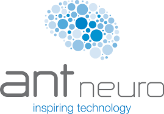
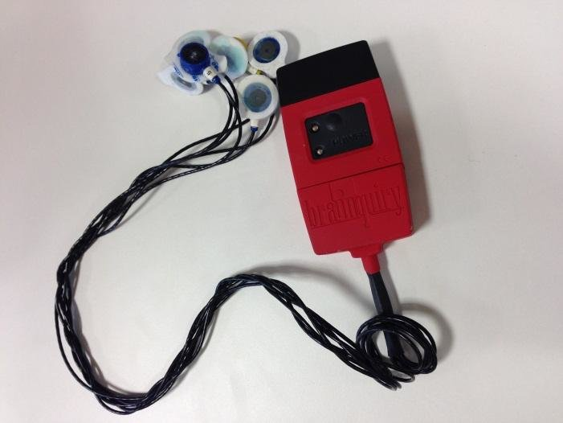
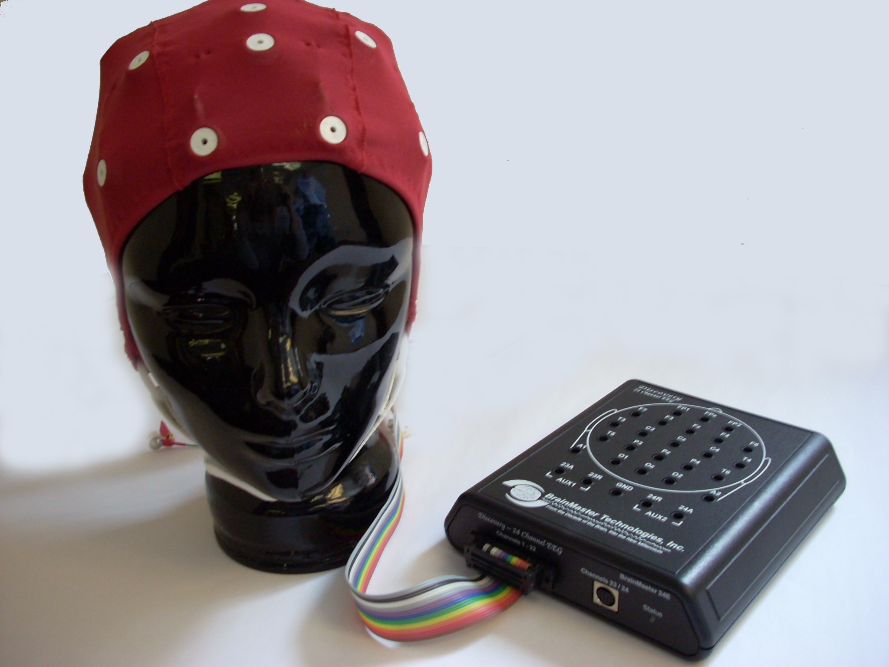

#Device Overview

neuromore Studio supports a variety of medical-grade and consumer-grade EEG devices, amplifiers, and other biosensors.

## Electroencephalography (EEG)

| Vendor      | Device                 | OOB | SDK | Win10     | Linux | MacOS | Brainflow |
| ----------- | ---------------------- | --- | --- | --------- | ----- | ----- | --------- |
| ABM         | B-Alert X10, X24       | No  | Yes | Yes (x86) | No    | No    | No        |
| ANT Neuro   | eego amplifiers        | Yes | No  | Yes       | No    | No    | Both      |
| Brainbit    | Brainbit EEG           | Yes | No  | Yes       | No    | Yes   | Yes       |
| Brainmaster | Discovery 20           | Yes | Yes | Yes (x86) | No    | No    | No        |
| Brainquiry  | PET 4.0                | No  | Yes | Yes (x86) | No    | No    | No        |
| Callibri    | EEG                    | Yes | No  | Yes       | No    | Yes   | Yes       |
| G.TEC       | Unicorn                | Yes | No  | Yes       | Yes   | No    | Yes       |
| Emotiv      | EPOC 1.0               | No  | Yes | Yes       | No    | WIP   | No        |
| Emotiv      | Insight 1.0            | No  | Yes | Yes       | No    | WIP   | No        |
| FreeEEG32   | ---                    | Yes | No  | Yes       | Yes   | Yes   | Yes       |
| Interaxon   | Muse 2 (2014)          | Yes | Yes | Yes       | Yes   | Yes   | Both      |
| Mitsar      | EEG 201                | Yes | Yes | Yes       | ?     | ?     | No        |
| NeuroSky    | MindWave Mobile MW003  | No  | Yes | Yes       | No    | WIP   | No        |
| Neurosity   | Notion, Notion2, Crown | Yes | No  | Yes       | Yes   | Yes   | Both      |
| OpenBCI     | Cyton (+Daisy) V3-32   | Yes | No  | Yes       | Yes   | Yes   | Both      |
| SenseLabs   | VERSUS                 | Yes | No  | Yes       | Yes   | Yes   | No        |

- OOB (out of box): No self-compile needed. Works with our github release versions.
- SDK: Vendor provides a (proprietary) SDK that is required at compile-/runtime
- Brainflow: Works through the Brainflow node in neuromore Studio. All Brainflow devices are listed at the bottom under the Brainflow section

## Heart Rate Monitoring (HRM)

All Bluetooth LE based heart rate monitors should work.
The following ones have been tested explicitly:

| Vendor   | Device | OOB | Win10 | Linux | MacOS | Brainflow | Notes                     |
| -------- | ------ | --- | ----- | ----- | ----- | --------- | ------------------------- |
| Callibri | ECG    | Yes | Yes   | No    | Yes   | Yes       |                           |
| Polar    | H7     | Yes | Yes   | Yes   | Yes   | No        | Must be paired on Windows |

## Electromyography (EMG)

| Vendor   | Device             | OOB | Win10 | Linux | MacOS | Brainflow |
| -------- | ------------------ | --- | ----- | ----- | ----- | --------- |
| Callibri | EMG                | Yes | Yes   | No    | Yes   | Yes       |
| Oymotion | gForce, gForce Pro | Yes | Yes   | No    | No    | Yes       |

#Device Details

## ABM B-Alert X10/X24

- Platforms: Windows
- Devices: B-Alert X4, X10 and X24

- Requires proprietary SDK
- Ours includes WIN-X86 only
- No Download link

**Steps**

- Copy \*.h from SDK to [here](https://github.com/neuromore/studio/tree/master/deps/include/ABM)
- Copy ABM*.lib and ABM*.dll from SDK to [here](https://github.com/neuromore/studio/tree/master/deps/prebuilt/win/x86)
- Enable `INCLUDE_DEVICE_ADVANCEDBRAINMONITORING` in [Config.h](https://github.com/neuromore/studio/blob/master/src/Engine/Config.h) of Engine
- Build (Windows x86 only)

## ANT Neuro

- Platforms: Windows

The amplifiers of ANT Neuro can be used out of the box on Windows machines. Just make sure that ANT devices are enabled in the Settings in neuromore Studio and you're ready to go.

## Bluetooth Smart Heart Rate Sensors

- Platforms: OSX

The OSX version of neuromore Studio supports all kinds of Bluetooth LE heart rate sensors. Just power on your Bluetooth LE heart rate sensor and neuromore Studio will automatically detect it. This can sometimes take up to a minute. In case it doesn't find heart rate sensor, try turning it off and on again.

- [Polar H7](http://www.polar.com/en/products/accessories/H7_heart_rate_sensor)
- [Zephyr HxM Smart](https://www.zephyranywhere.com/system/hxm)

Note that we currently can only confirm that the Polar H7 works. Other devices should work too if they adhere to the BTLE profiles and send BPM as well as RR interval data. Please let us know if you found other devices that work or do not work.

## Brainquiry PET 4.0

- Requires proprietary SDK
- Ours includes WIN-X86 only
- No Download link

**Steps**

- Copy **BQPetDLL.h** from SDK to [here](https://github.com/neuromore/studio/tree/master/deps/include/brainquiry)
- Copy **BQPetDLL.lib** and **BQPetDLL.dll** from SDK to [here](https://github.com/neuromore/studio/tree/master/deps/prebuilt/win/x86)
- Enable `INCLUDE_DEVICE_BRAINQUIRY` in [Config.h](https://github.com/neuromore/studio/blob/master/src/Engine/Config.h) of Engine
- Build (Windows x86 only)

## Brainmaster

- Platforms: Windows (x86)
- Devices: Discovery 20

To use the Brainmaster Discovery 20 you first need to contact Brainmaster to get the .dll library file called bmrcm.dll which you will need to copy into the folder where the Studio.exe resides.
Once you have done that you can start Studio (x86) and can start streaming EEG. To also read impedance values at runtime go to Settings>Devices and set the serial number and device password. Then you will be able to test the impedance in the "Devices" window.

## Emotiv EPOC/Insight

Uses public, but proprietary [community-sdk](https://github.com/pandark/emotiv-community-sdk) for integration.

**Steps**

- Copy \*.h from [here](https://github.com/pandark/emotiv-community-sdk/tree/master/include) to [here](https://github.com/neuromore/studio/tree/master/deps/include/emotiv)
- Win32: Copy _.lib from [here](https://github.com/pandark/emotiv-community-sdk/tree/master/lib/win32) and _.dll from [here](https://github.com/pandark/emotiv-community-sdk/tree/master/bin/win32) to [here](https://github.com/neuromore/studio/tree/master/deps/prebuilt/win/x86)
- Win64: Copy _.lib from [here](https://github.com/pandark/emotiv-community-sdk/tree/master/lib/win64) and _.dll from [here](https://github.com/pandark/emotiv-community-sdk/tree/master/bin/win64) to [here](https://github.com/neuromore/studio/tree/master/deps/prebuilt/win/x64)
- Enable `INCLUDE_DEVICE_EMOTIV` in [Config.h](https://github.com/neuromore/studio/blob/master/src/Engine/Config.h) of Engine
- Build

### Emotiv EPOC / EPOC+

- Platforms: Windows
- Devices: EPOC, EPOC+

Plug in your dongle and turn on the device either before you start or while neuromore Studio is running. Connected devices will be detected automatically and shown in the interface.

### Emotiv Insight

- Devices: Insight with Emotiv Receiver Dongle

Please be aware that the Emotiv Insight has [known issues](https://emotiv.zendesk.com/hc/en-us/articles/204819169-Bluetooth-Connectivity-Issues) regarding Bluetooth LE connectivity and might not work correctly even if the operating system and USB receiver adhere to the standard. We found that the best solution is to use the [Emotiv USB Receivers](https://emotiv.com/store/product_9.html) (requires one receiver per device). This is the same receiver used by the Epoc+.

Plug in your dongle and turn on your Insight. Feel free to open neuromore Studio before plugging in the dongle or turning on the Insight. It will work both ways and the device will be automatically shown in the interface once the connection is established.

##InteraXon Muse

- Platforms: Windows, OSX, Linux
- Devices: Standard Muse (model MU-01) with the default preset

**SDK v3.4.1**

_Note: These links are from Google's [cache](https://sites.google.com/a/interaxon.ca/muse-developer-site/download). Vendor took the old SDK sites offline, see [here](https://choosemuse.com/development/)._

- [Windows](http://storage.googleapis.com/ix_downloads/musesdk-3.4.1/musesdk-3.4.1-windows-installer.exe)
- [OSX](http://storage.googleapis.com/ix_downloads/musesdk-3.4.1/musesdk-3.4.1-osx-installer.app.zip)
- [Linux](http://storage.googleapis.com/ix_downloads/musesdk-3.4.1/musesdk-3.4.1-linux-installer.run)

**Steps**

- Download and install the SDK(s)
- Win10: Copy the **Muse** folder from the installed location `%PROGRAMFILES(X86)%` to the folder of the Studio executable.
- Start Studio and run **muse-io** from the `Tools` menu bar entry

- Win10: Will automatically start the **muse-io.exe** in subfolder **Muse**
- OSX/Linux: Will show a dialog and ask you to manually locate and start **muse-io** from the SDK
- No compiling required. `INCLUDE_DEVICE_INTERAXON_MUSE` is enabled by default.

##Mitsar

- Platforms: Windows
- Devices: Mitsar EEG 201-21, EEG 202-24 and EEG 202-31

- Requires proprietary SDK
- Requires MitsarConnector.exe from SDK to stream to Studio using OSC

Steps

- Download SDK
- Copy SDK folder Mitsar (MitsarConnector.exe must be inside) to the location of the Studio executable.
- The MitsarConnector.exe is started automatically (if present) by triggering a device search in Studio
- No compiling required. _INCLUDE_DEVICE_MITSAR_ is enabled by default.

##Neurosity

- Platforms: Windows, MacOS, Linux
- Devices: Notion, Notion2 (Crown coming soon)

To use Neurosity devices with neuromore Studio, you'll have to prepare a few steps:

_Enabling OSC in the Neurosity developer console_

You'll have to enable OSC support in the Neurosity developer console.

1. In case you don't have a Neurosity dev account yet, follow [this short guide](https://support.neurosity.co/hc/en-us/articles/360036196792-Create-account-with-Neurosity) to set up your account.
2. Go to your device settings in to the [developer console](https://console.neurosity.co/settings) and enable OSC.
   

_Connecting your Neurosity device in neuromore Studio_

1. Go to the Network Settings (go to _Edit>Settings>Network_ (Windows) or _NMStudio>Settings>Network_ (MacOS)) and set the Input UDP port to 9000. This is necessary as the Notion devices stream their data through OSC to the Studio.
   

2. Make sure the device is on the same WIFI network as your computer.
3. Start the device, go to the "Devices" window and click on the search icon (if it is not automatically recognized)
4. Find the device ID in the "Devices" window in neuromore Studio.
   
5. Set the "Device Number" of the Neurosity node in the classifer to the device ID incremented by 1 (e.g. if the device ID is 33285 set it to 33286 in the classifier).
   
   Note: at the moment we still experience a drift when streaming from Neurosity devices which means that the signal might not be consistently streamed. We are working on a fix for that at the moment with the Neurosity team.

##NeuroSky

- Platforms: Windows
- Devices: MindWave (model MW003)

1.  If you have never connected a MindWave before you must first enable the driver in the settings once (see image).
2.  Make sure your device is paired to your PC, is turned on and in reach of the receiver
3.  The MindWave will automatically appear in neuromore Studio once the connection is established

##OpenBCI

- Platforms: Windows, OSX
- Devices: OpenBCI 8/32-bit 8 channels (without Daisy module)

Before connecting your board go to the Settings (on Windows: _Edit>Settings>Devices_, on MacOS: _NMStudio>Settings>Devices_) and make sure that _Enable OpenBCI Devices_ is selected.
Then connect your OpenBCI board to your computer. Make sure to take the following steps before using it with neuromore Studio:

_Windows_: Make sure your board is recognized as a COM port and that its latency is set to 1 ms. To troubleshoot, read the [OpenBCI on Windows tutorial on their official site](https://docs.openbci.com/Troubleshooting/FTDI_Fix_Windows/).

_Mac OS_: Make sure your board is connected and visible as a device. To check you can type `ls /dev/tty.*` on your terminal. An example connected OBCI board should look like this:

`neuromore-MacBook:~ neuromore$ ls /dev/tty.* /dev/tty.OpenBCI-DN00959R`

To troubleshoot, visit OpenBCI's [FTDI buffer fix for MacOS site](https://docs.openbci.com/Troubleshooting/FTDI_Fix_Mac/).

##SenseLabs Versus

- Platforms: Windows
- Devices: Versus (non-BTLE version)

Important: We do not support the consumer Bluetooth LE version of the Versus that is sold on their website right now. neuromore Studio only supports the version that comes with a standard Bluetooth interface. Please contact [SenseLabs](https://senselabs.com) for further information on how to buy this research edition of the Versus.

_Setting up the Versus_

It is very important that you follow this setup procedure the first time you connect your Versus to a Windows PC. If you don't do this it will break your device and you will have to reset it (described below).

1.  Pair the Versus with your Windows PC
2.  Make sure neuromore Studio (or any other software that could access the device) is **not running**
3.  Open the _Devices and Printers_ Windows Control Panel
4.  Right click on your Versus device and select _Properties_. A window will pop up.
5.  Disable the _Wireless iAP_ service under the tab _Services_.

**Resetting the Versus**
If you started an application that accessed the Versus _before_ you disabled the iAP bluetooth service you will have to reset device:

1.  Turn off the Versus.
2.  Turn it on again but don't release the button.
3.  Keep the button pressed until the LED blinks red. The device is now reset.

# Brainflow devices

- Platforms: Windows, MacOS, Linux
- Devices:
  - [OpenBCI](https://openbci.com/) Cyton, Ganglion, Daisy, Galea, Cyton WIFI, Ganglion WIFI & Daisy WIFI
  - [Brainbit EEG](https://brainbit.com/?gclid=Cj0KCQjw1ZeUBhDyARIsAOzAqQKLEdjZaoNE1iQWmrtR6HIyRxtxCdnkIePywI3daevRkn74qz5S760aAuifEALw_wcB)
  - [G.TEC Unicorn](https://www.unicorn-bi.com/)
  - [Callibri](https://callibri.com/) EEG, EMG, ECG
  - [Neurosity](https://neurosity.co/) Notion & Notion2 (Crown coming soon)
  - [Oymotion](http://www.oymotion.com/en/product32/149) GForcePro EMG Armband
  - [FreeEEG32 board](https://www.crowdsupply.com/neuroidss/freeeeg32)
  - [Brainflow Playback, Streaming & Synthetic board](https://brainflow.readthedocs.io/en/stable/SupportedBoards.html#brainflow-dummy-boards)

Brainflow is a great middle layer library integrating a variety of different biosensors with APIs for different programming languages.
Thanks to [Andrey](https://github.com/Andrey1994)'s integration, neuromore Studio allows you to use all of those sensors as well to build your application through its no-code visual interface.

To use a biosensor using Brainflow, you will have to set the board_id, the serial_port, and sometimes the mac_address or the ip_address/ ip_port fields.
Please have a look at [their documentation](https://brainflow.readthedocs.io/en/stable/SupportedBoards.html) to find these parameters.

# Device Settings in Studio

Can be accessed using the menu bar entry `Edit`->`Settings`

Check:

- Your real/desired device is enabled here
- The test device is disabled if you got a real EEG (not required, but recommended)

Others:

- By default devices are not discovered automatically (see `Automatic Device Search` setting).
- Manual scan is initiated by clicking the loupe icon in the Devices widget.

# OSC Streaming / Unsupported Devices

- Any device can be integrated if its SDK supports OSC streaming
- Use the `OSC Input` node and send data to its configured OSC address.
