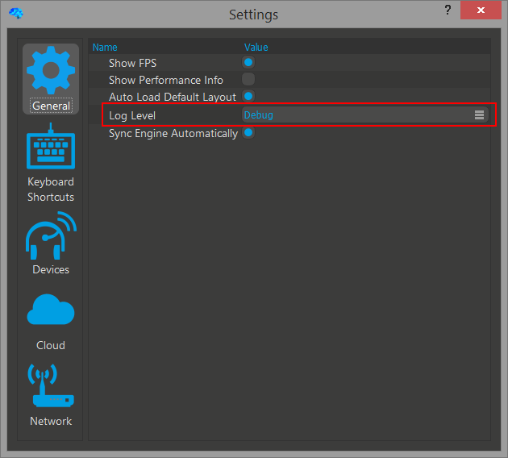

#Debugging

##How can I control the log level and where do I find the log file?

Open the settings via 'Tools'->'Settings' and set the 'Log Level' to 'Debug' as shown in the screenshot. You don't need to confirm nor accept the new log level and the application will use it as soon as you selected the new combo box item. Note that the 'Debug' log level will decrease your performance and it should only be used for hunting bugs or gathering information.

In case you can't even start neuromore Studio to change the debug log level in the settings window, you can change it manually in the config file. The config file is called 'NMStudio_settings.cfg' and is located in the same folder as the log file. Please change the log level preset to 'logLevelPreset=Debug' and restart neuromore Studio.

The log file is called 'NMStudio_Log.txt' and is located at:

- Windows: 'C:\Users\%YOUR_USER_NAME%\AppData\Local\neuromore\NMStudio'
- OSX: '/Users/%YOUR_USER_NAME%/Library/Application Support/neuromore/NMStudio'