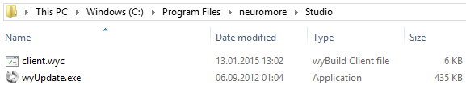
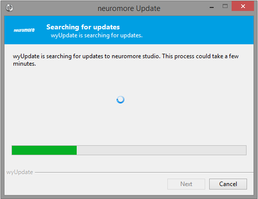

#Installation

##Windows

###1. Download

Please login to our user portal (https://account.neuromore.com) and download the auto updater archive from the 'Downloads' section.

###2. Extract

Extract the files to your desired location for neuromore Studio, e.g. "C:/Program Files/neuromoreStudio".

Please make sure the files from the package are located in a new folder with no other data. All files belonging to neuromore Studio will be automatically downloaded and extracted to the same folder when installing/updating.

###3. Install

Double-click the "wyUpdate.exe" the auto updater will check for the latest version and install it.

###4. Run

neuromore Studio will be automatically started after the installation process finished. Please make sure to allow network access at the windows firewall. You will find a shortcut on your desktop that you can use to start the application.

##OSX

###1. Download

Please download the latest neuromore Studio .dmg file from the 'Downloads' section inside the user portal (https://account.neuromore.com).

###2. Extract

Double click the downloaded .dmg file and extract the containing application to a desired folder, e.g. "/Applications/.

###3. Run

Double click the extracted application.