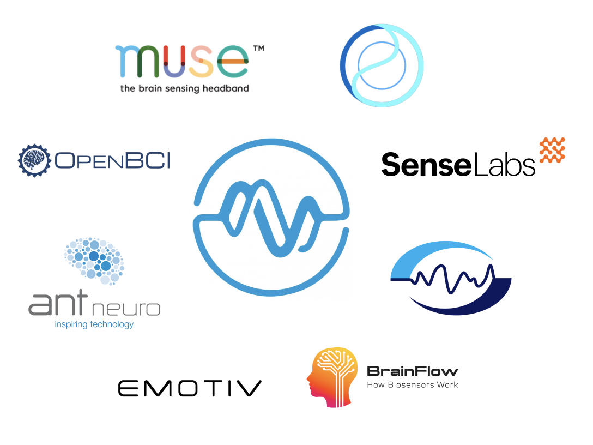
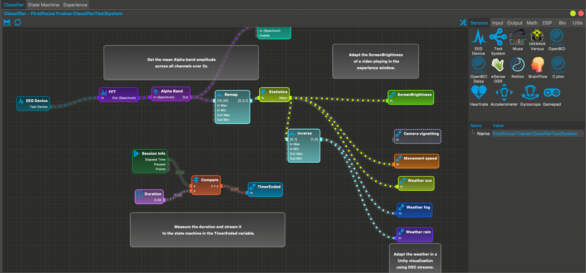
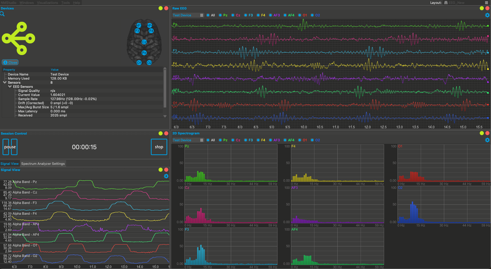

# What is neuromore Studio?

Neuromore Studio is your platform to easily build neurotech products, applications and services.

## What tools and applications can I create with neuromore Studio?

With neuromore Studio you can build interactive neuro-/ bio-feedback applications and advanced data analysis solutions for a variety of use cases in the medical, therapeutical and personal development domains.
For example, applications that have already been built using neuromore's platform are being used from burnout prevention and performance increasement over depression treatment, stress relief, focus training for ADHD, stroke therapy and trauma therapy to neuromarketing and breath pacers.

## A hardware-agnostic platform to interface all major bio-sensors

We don't want you to worry about the hardware integration which is why neuromore Studio is hardware-agnostic, designed to support all major EEG devices and other bio-sensors.

At the moment it supports a variety of EEG devices, from consumer headsets (e.g., Interaxon Muse 2, Neurosity Crown) over OpenBCI boards to medical grade amplifiers (e.g., ANT Neuro's Eego, Brainmaster Discovery), heart rate monitors, GSR sensors and other bluetooth devices that you can effortlessly connect to your applications.

## Signal Processing without Coding

We believe that you shouldn't need to be a developer to create advanced signal processing pipelines. That’s why one of the main features of neuromore Studio is its no-code visual editor that allows anyone from neuroscientists to clinicians, artists, researchers and developers to create neurofeedback protocols and data analysis pipelines.

## Advanced Neurofeedback Experiences

The Studio's powerful toolbox allows you to easily create custom protocols: neuroscientists have already built complex protocols like multi-channel Alpha/Theta amplitude training with auto thresholding. The toolbox contains all major signal processing functionalities like _Fast Fourier Transformations_, _Band Selection_, _Dominant Frequency Extraction_ and more. For more information go to the _Nodes_ section in the documentation.
For further examples of protocols created using neuromore Studio have a look at the examples in the backend-file system.

The Studio also comes with a variety of immersive state-of-the art visualizations for neurofeedback. It also enables you to create custom experiences with screen interaction, e.g., if you first want to record a baseline before starting the session. For more information refer to the _Experiences for Neurofeedback_ section.

## Data Analysis and Visualizations

Neuromore Studio also offers a variety of windows to visualize your data and investigate the signals in real time. From Raw EEG plots over spectrum views to viewing your processed signal there are many ways to investigate your data within the Studio.

Apart from that neuromore Studio also has a cloud integration if you want to store session reports, research results or analyses.

