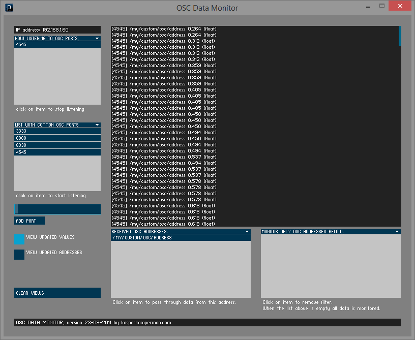
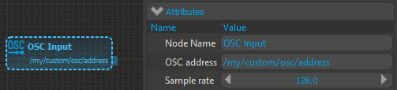
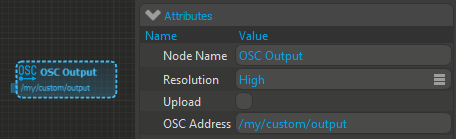
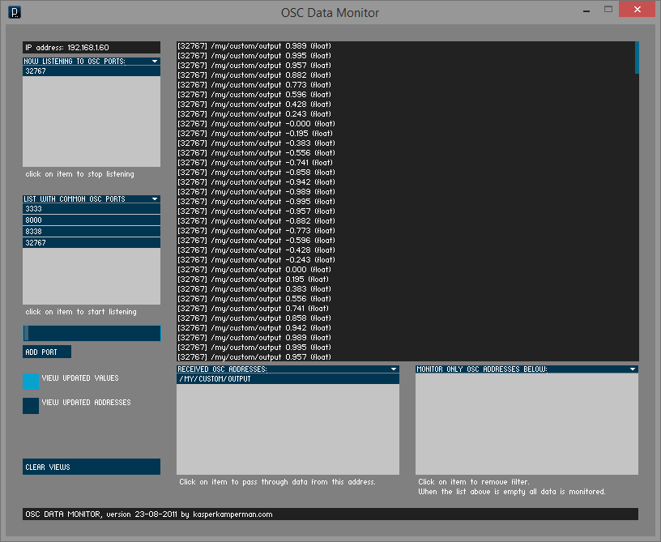

#OSC Tutorial

neuromore Studio comes with OSC input and output capabilities for communicating with it, controlling external software and machinery, and feeding in data from custom sources.

##Feeding custom data to neuromore Studio

We for sure don’t support every data source that you can imagine. That is why we provide a way to send custom values from your sources (like biosensors, accelerometers, joysticks, other software) via UDP network messages using the Open Sound Protocol (http://opensoundcontrol.org). OSC helper libraries are available for nearly every programming language.

Send single floating point values with a given OSC address. Using an "OSC Input" node inside the "Inputs" category of the “Classifier Window”, you can feed your custom values to the classifier. OSC addresses need to be unique and need only to contain a single float value (No bundling or grouping, one OSC address for each float).

You can use the “OSC Data Monitor” to verify the sent messages: https://code.google.com/p/osc-tools/

Add your OSC input port (Default in neuromore Studio is 4545) to the OSC Data Monitor and make sure it is in the “Now Listening to OSC ports”. In case sending works correctly the OSC data monitor will show something like in the following screenshot.

(4545) /my/custom/osc/address 0.264 (float)

Now you can open up neuromore Studio, create a new or load your already existing classifier and drag & drop an OSC input node to it. Be sure to connect it to a feedback node or something else so that it becomes active. Select your OSC input node to see its settings and enter the OSC address that you have chosen for your value.

Note that incoming OSC values get resampled to a constant sample rate to comply with our signal processing principles. This means that you don’t need to make sure that OSC messages come in with a fixed timing, we’ll take care of that. In case you work with a different sample rate inside your classifier, please adjust the node’s sample rate.

##Reading data from classifiers

Next to feeding in custom values, you can also send given values of your classifier inside neuromore Studio via OSC network messages to an external place. This can be e.g. used to drive your visualizations, generate sounds, set the color of your Wifi connected lights or anything else that can read OSC network messages.

To send custom OSC network messages from neuromore Studio, our classifier needs an “OSC Output” node from the “Output” category. Enter the value’s OSC address inside the node attributes. You can also choose if the node shall upload its samples to our cloud after finishing a session or not. The resolution sets the transmission rate of the OSC network messages. “Low” will send 4 messages per second, “Mid” will do 30 and “High” will update 60 times per second.

As described in the feeding section of this tutorial, the values sent by the OSC output nodes can be checked using the OSC Data Monitor (see screenshot below). Please make sure that you connected an input to the OSC output node. It only sends network messages with a valid input. Note that the default port for outgoing OSC network messages in neuromore Studio is 32767.

##OSC settings in neuromore Studio

Using the menu “Edit->Settings” and then selecting the “Network” category on the left you can access our OSC settings. On default, neuromore Studio only sends OSC network messages from feedback and OSC output nodes to localhost (127.0.0.1). Feel free to change the IP in case you’re using another machine for your receiver application. You can adjust the input UDP port for feeding neuromore Studio with custom data as well as the port for outgoing OSC messages from your OSC output nodes.