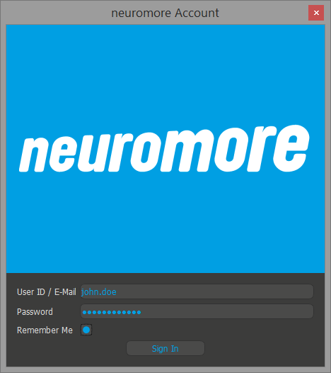
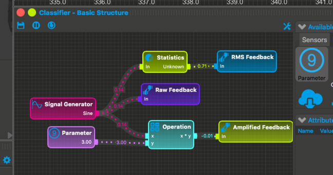
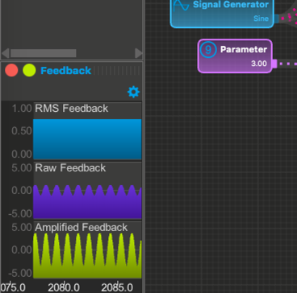
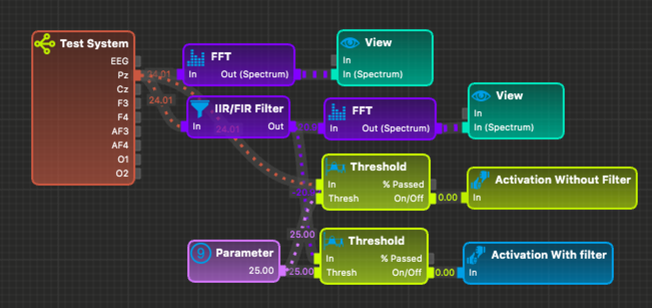
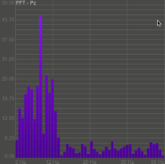
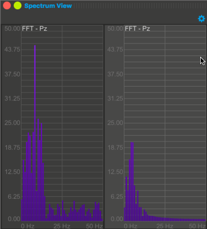

#What is neuromore?

**In short, neuromore is a bio-data acquisition, processing and visualization software, all in one.** 

In general, neuromore allows users to connect to sensors such as EEG, Heart rate monitors, etc and read their incoming data in real time. Neuromore then parses this information through a data processing system designed by the user. Finally, the output of this system is connected to outputs such as  vizualization windows, external tiggers, etc. 

#Vocabulary
Some definitions that might come in handy for the remainder fo ths document and forum discussions about neuromore.

#####Classifier
We call classifiers the complete system from data acquisition to outputs. The name classifier comes from the machine learning lingo where classifiers are algorithms that take in data and assign that date a most probable label or class. While neuromore can be used to create many systems that are not classifiers, conceptually, they are one of the most useful systems that neuromore aims to create.

#####Graphs
Neuromore uses [visual programing](https://en.wikipedia.org/wiki/Visual_programming_language) to facilitate the creation of classifiers. In particular, neuromore uses connected graphs that allow user to 'code' data processing routines more intuitively.

#####Nodes
Graphs are made up of interconnected nodes. These nodes act like engineering 'black boxes' that allows user to create functioning graphs just by knowing what individual nodes do without need to understand how they do it. A comprehensive list of all nodes with their inputs, outputs and function can be found in the Nodes section of the documentation.

****
#Getting Started
The following guide will take you from knowing next to nothing about neuromore to undestanding both its capabilities and how to implement those capabilites for your own purposes. 

##Logging in

When starting neuromore Studio the first time, it will ask you for your user account and your password. Please enter either your e-mail address or your user account name and your password into the given fields and press 'Sign In'.

In case you want neuromore Studio to remember your login information for the next time, enable the 'Remember Me' checkbox before signing in. Your login information will be stored using AES256 encryption on your local disk.

You can sign out via the 'Help' menu entry 'Sign Out'. This will also destroy the encrypted login information on your local disk. Next time you start neuromore Studio you will be prompted to enter your login information again.

##Browsing examples

If you are new to neuromore, a good place to start is to visit our example [classifiers](#Vocabulary) in the 'Back-End File System' window located on the right side. 

This is a hierarchical view with folders and files (like in Windows Explorer or OSX Finder). Just click an item and it will open the classifier and show its [graph](#Vocabulary).

The example classifiers are read-only files and you won't be able to change its graph. In case you want to modify an example and play around with it, right click the classifier item and select 'Create Copy In Personal Folder'. A new file will appear in your personal folder which is named the same way as your user id.

Use the tool icon in the classifier window to start editing the classifier. New nodes can be created via drag & drop from the 'Available Nodes'. Selecting a node will show up its attributes.

<!--TODO: Include getting started folder in examples folder-->
*Recommended:* Follow along with the examples in this getting started guide.
 
##Basic Classifier Structure

This example shows a minimal classifier that shows the main structural components of a graph:

**Input:** Signal Generator producing a sine wave with default parameters. (Frequency = 1 Hz, Amplitude = 1)

Parameter, the multiplying factor for my amplifier system. In particular, the integer 3.

**Processing:** The processing logic. In this case, computing both an amplified (3x) version of the input and the RMS value of the signal.

**Output:** The Feedback output nodes take in a signal and display it in the feedback window (normally bottom left).

In particular, this feedback is displaying both the raw input signal and the amplified signal together with the constant RMS value.

##Basic EEG Classifier

Now that we know the basics a classifier, we are ready to see an EEG classifier.

This example is of a basic frequency threshold classifier. The input is the Test System node that gives us a pre recorded signal that while is not EEG, has similar signal properties. 

From this input node we are interested in the Pz electrode (see [10-20 system](https://www.trans-cranial.com/local/manuals/10_20_pos_man_v1_0_pdf.pdf)). 

We can see that this node is connected directly to three other nodes. The first is an FFT node that computes the [fast fourier transform](http://mathworld.wolfram.com/FastFourierTransform.html) on the signal which essentially maps the signal to the frequency domain. If we conenct the output of this node to a Spectrum input of the View node we can then see the power of the individual frequencies present in the raw signal.

The second copy of the EEG data stream goes to an IIR/FIR Fitler node. In particular this node is set to act as a [low pass filter](https://en.wikipedia.org/wiki/Low-pass_filter) with a cut off frequency of 5 Hz.

As we can see in the figure below, when we then input this filtered data stream into an FFT + Spectrum View sub-graph the resulting signal contains much lower powers for frequency bands beyond 5 Hz.

<!--TODO: Exlain Threshold-->

