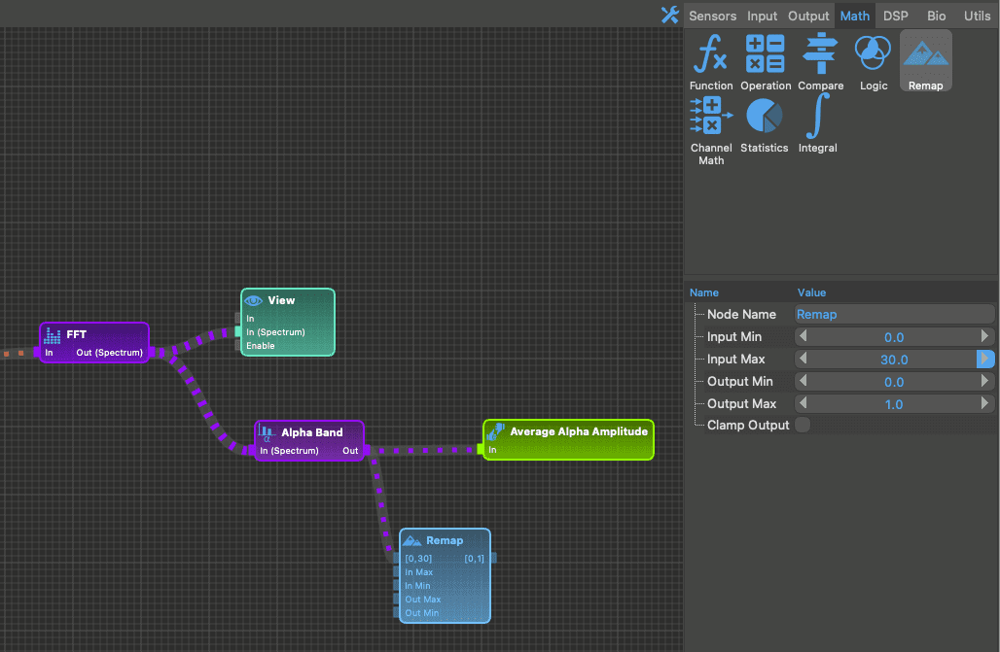
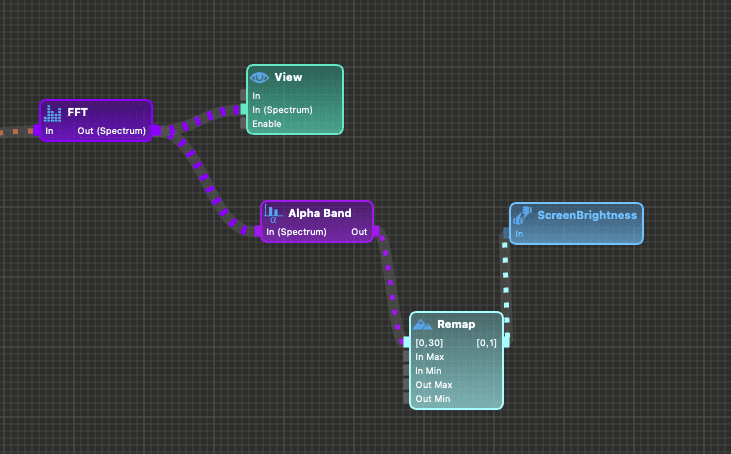
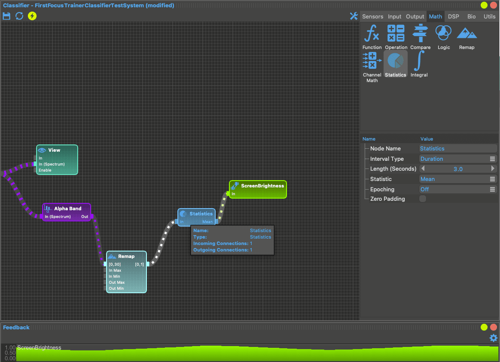

# Your first neuro-feedback app

## What will we build?

In this tutorial we will build a basic focus trainer using an OpenBCI headset from end to end.
If you're new to neuromore Studio we would highly recommend to follow the tutorial to get familiar with the core concepts and capabilities and to get confident with the user interface. You will learn about building signal processing pipelines, defining application logic, and working with the customisable layout.

The application we'll build will first prompt the user for how long they want to train before playing a video whose brightness depends on the user's focus. In this basic example we will use the user's average Alpha band activity as a proxy for focus.

## A neuromore application in a nutshell

A neuro-/ bio-feedback application created in neuromore Studio consists of 3 parts:

1. a _classifier_ in which we define the graph of the **signal processing pipeline**. Here we can define all sorts of common signal processing operations like FFTs or filters on the biosensor data and either stream it into custom variables, visualise it, or store it in a log file.
   In our example we want to **dynamically measure the user's focus** for which we will use their neural Alpha band activity as a simple proxy - the higher the average Alpha amplitude (compared to the amplitude of the other bands) the higher the user's focus.
2. a _state machine_ in which you define the **application logic**. In our example the state machine will handle the flow from starting the experience over selecting the training duration to adapting the screen brightness based on the current average amplitute on the alpha band.
3. the _actual experience_ that your users will interact with. This can be an **application using simple widgets available in neuromore Studio** as in this example, a **game built in Unity**, or an **app running on a mobile phone**.

## Creating a blank project

Projects are stored in the **neuromore back-end file system**. When you first open neuromore Studio you will find a window in the top-right corner where you can see example projects.
To create our new project, let's create a folder with the name of your choice.

## Creating a new classifier

Classifiers and state machines are stored in separate files. Let's select our new project folder and create a new classifier file.

## Adding a biosensor

In the _Input_ category you have a variety of devices to choose from. For this example we will use the OpenBCI v3 sensor.
To use it, first connect your OpenBCI board to your computer. Make sure to take the following steps:

Windows: Make sure your board is recognized as a COM port and that its latency is set to 1 ms. To troubleshoot, read our OpenBCI on Windows tutorial.

OS X: Make sure your board is connected and visible as a device. To check you can type ls /dev/tty.\* on your terminal. An example connected OBCI board should look like this:

Drag the OpenBCI device into your classifier to start designing the signal processing pipeline.

## Getting the frequency band

To get the average alpha band activity we first need to map the signal onto the frequency domain. For that we drag a _[Fast Fourier Transformation (FFT)](https://en.wikipedia.org/wiki/Fast_Fourier_transform)_ node into the graph and connect itto the EEG output pin of the OpenBCI device.

## Visualising the frequency spectrum

The _FFT_ node gives us a frequency spectrum. To get an idea how that spectrum looks like let's drag in a _View_ node from the _Output_ tab and connect the output from the _FFT_ to the "Spectrum" input of the _View_ node.

A frequency spectrum is rendered within a _Spectrum View_ which we don't have in the current layout yet. Luckily, customising the layout of neuromore Studio is very straight forward: go to Windows -> Add -> Spectrum View in the menu at the top and the view will show up in the middle of the screen.

Great! There we have the first visualisation of the frequency spectrum coming from the sensor. As we can see the amplitude for the bands between 3 and 12 Hz are quite high at the moment of the screenshot, indicating a stronger Delta, Theta, and Alpha activity.

Before continuing to get the average Alpha amplitude let's get the _Spectrum View_ out of the way to clean up the view. You can do that by moving the window around which makes it snap into the layout.

## Getting the Alpha band amplitude

Back to our classifier: we can now filter the frequency spectrum for the Alpha band by adding a _Frequency Band_ node to the graph. We can see that the default _Value_ of the _Frequency Band_ node is already set to "Average Amplitude" which is exactly what we want.

We now want to stream the average Alpha amplitude into a variable so that we can control the video brightness based on its value.
In neuromore Studio we can expose custom variables of the classifier using _Custom Feedback_ nodes available under the _Output_ tab.

As we drag the node in and connect it to the output of the _Frequency Band_ node we see the average Alpha amplitude being streamed between the two nodes. Also the graph shows us that the value is not in range: we hence need to adapt the value range of the _Custom Feedback_ node. Let's set it to a range of 0 to 100 where maximal focus is reached when the Alpha amplitude is at 100. This is of course not a real focus trainer - for that we would have to assess a baseline first or dynamically compare the Alpha activity with the activity of the other bands. But for now it should be enough to get the idea of creating an end-to-end neuro-feedback application in neuromore.

To control the brightness of our video we need to map the average Alpha amplitude to a range of 0 to 1. neuromore Studio offers a variety of mathematical operations under the _Math_ tab: one of them is a _Remap_ node which we now drag into the graph. Set its input range to 0 - 100 and its output range to 0 - 1 while enabling output clamping.
Then place it in between the _Frequency Band_ and the _Custom Feedback_ node and remove the link between those two nodes by right-clicking it.

We could now access this feedback variable called Average Alpha Amplitude from the state machine.
As we want to control the brightness of our video though, a very common feedback operation in neurofeedback applications, we can also directly call it "ScreenBrightness" - the neuromore Engine running the state machine will then automatically map the value of this node to the screen brightness of the running experience.
Let's also drag in an additional statistics node to smoothen the brightness signal by averaging it over the last 3 seconds.

_Note: besides "ScreenBrightness" you can also control the volume of the experience within neuromore Studio with the pre-defined feedback operation "Volume"._

## Creating the state machine

Let's now add our application logic. Our user flow will primarily consist of 2 steps: first the user will see a screen with 3 buttons to choose the duration of the training from; then they will see a video whose brightness depends on their focus (the average Alpha amplitude). This video will
For that flow we now need to create a _state machine_.

## Adding the first states to the state machine

A state machine always consists of at least two states, a _start_ and an _end_ state which mark the beginning and the end of a neurofeedback session.
In between those are _action_ states to which the state machine transitions when the transision condition is met.
In the _action_ states we can then fire events like showing text or starting a video on enter or on exit.

Let's look at an example: right-click into the state machine window and add a _start_ state and an _action_ state to the new state machine.

## Setting up the training duration prompt

At the first _action_ state we want to prompt the user to select the duration of the training. For that let's rename the node and add an on-enter action to show the text 'How long do you want to train?' on the screen.

## Adding the experience window

To see our experience in action we need an _Experience_ and a _Session Control_ window which we can add via the _Windows_ pane on the top bar. We can also switch the layout through the dropdown in the top-right corner: let's select the _Experience Designer_ layout and add the _Session Control_ there.
If we do that and then click on _Start Session_ in the _Session Control_ we now see our UI.

## Adding buttons to select the training duration

We want to give the user 3 options: training for 1, 3 or 5 minutes. One way to do that is to add 3 action states with a _button condition_ each on the transition.
For all button conditions of outgoing transitions of a state the experience window will display a button on the bottom of the screen, in this case below the duration prompt. Let's add 3 more actions for each training option with button conditions reading '1 minute', '3 minutes' and '5 minutes'.

The result will then look as follows in the experience window.

## Sending data from state machine to classifier

To check if the training duration is over we need to write the duration value into a parameter.
We can then use that parameter in the classifier to compare it against the session time.
Let's create a parameter action for each of the 3 options actions and set the "Duration" parameter to either 60, 180, or 300.

## Checking if the duration is over

We now need to add a check in the classifier if the session time is over.
For that we drag in a _Session Info_ node and a _Parameter_ node which we call "Duration". This parameter will be set from the state machine.
We connect both outputs to the inputs of a _Comparator_ node and define the output to be 1 when the session time is greater than the duration.
To expose this variable to the state machine again we now need to stream the output into a _Custom Feedback_ node which we call "TimerEnded".

## Playing the video

After the user selected the duration we now want to play a video (& audio) whose brightness is controlled by neuro-feedback.
Add another state and add 3 actions: one to play a video of your choice, one to play an audio (in case your video doesn't have audio), and one to hide the text.

## Ending the neurofeedback session

We're almost there. The last thing to add is the _end_ state.
We want to end the training if one of 3 conditions is met: either the video is finished, the audio is finished, or the elapsed session time equals the "Duration" parameter.
While the audio and video conditions are straight forward, for the parameter condition we need to define the name of the feedback node ("TimerEnded") and that we only want to transition when its value is 1.

## Running the session

Congratulations, you've just built your first neuro-feedback application!
Start the session and enjoy your focus training!

# Browsing examples

If you want to explore more examples check out the example classifiers in the 'Back-End File System' window located on the right side.

This is a hierarchical view with folders and files (like in Windows Explorer or OSX Finder). Just click an item and it will open the classifier and show its graph.

The example classifiers are read-only files and you won't be able to change their graphs. In case you want to modify an example and play around with it, right click the classifier item and select 'Create Copy In Personal Folder'. A new file will appear in your personal folder which is named the same way as your user id.

<!--TODO: Include getting started folder in examples folder-->
