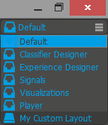
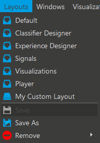

The layout of the windows in our tool is completely customizable. Windows can be moved around, resized and are either docked into the main window or floating over it. Undocking a window can be done by pressing undock icon located at the top right. In order to dock it back press dock icon. Undocked windows show a maximize and a pin button. The pin button enables and disables the ability to dock a window into the main window. While moving the window around, possible docking locations are highlighted and the windows align automatically.

#Switching between different layouts

There are three different ways to switch between layouts:

1. The fastest way is using the function keys (F1 to F0 depending on how many layouts you have created) on your keyboard. Remember that you additionally have to press the 'fn' key on OSX in order to make actually use the function actions.

2. Use the combo box on the top right to switch between layouts. Predefined layouts are at the top, your custom layouts are at the bottom.

3. Use the 'Layouts' menu entry to switch between layouts.