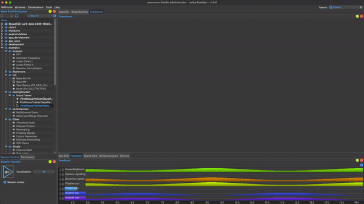

# How to Give Users Feedback?

Neuromore Studio offers you three ways to give users neuro- and bio-feedback:

1. Using one of our already existing **interactive games** (e.g., controlling the speed of a car or the weather)
2. Using a state machine and the integrated experience window (e.g., controlling the volume or screen brightness of a video or an audio file)
3. Controlling through any application of your choice using the OSC interface (e.g., we provide a Unity plugin but you could also use Ableton or a write a script for a Raspberry Pi to control the lights in your home).

Below we'll show you how to build experiences using the built-in visualizations, the experience window, and the Unity plugin. For more information about the OSC integration see the OSC section.

## Using Pre-Built Games and Visualizations

The fastest way to create a neurofeedback experience is using one of the pre-built games and visualizations that come with the Studio.

At the moment we have 4 visualizations that you can access through the "Visualizations" pane in the top bar of the Studio or through the eye icon in the _Session Control_ window.

Every game has a set of controllable feedback parameters that can be controlled from your classifier through the _Custom Feedback_ node.
On the right you can see an example of controlling various parameters of your game like the weather or the movement speed of a car. Neuromore Studio communicates with the visualizations through the OSC interface: that means that for each parameter you want to control you need to specify the OSC address of the _Custom Feedback_ node by double clicking it. Also make sure that _Send OSC Msgs_ is enabled.
For each existing visualization you can find the available feedback parameters below. Scroll down if you want to build your own games and experiences using Unity.

### What Visualizations Exist?

#### Cartoon Town

Drive a little car through a cartoon style town. The feedback will control the speed of the car while it automatically moves through the city. Ideal for kids.

####Infinite Tunnel
Immmerse yourself into the infinite tunnel. Enable the space ship with smoke effects for more variation. Feedback changes color and camera speed.

#### Forest Walk

Enjoy the peace and connect to nature while you're slowly walking through the forest.

####Tropical Island

Master controlling the sky and sea. The tropical island visualization adapts the weather from a sunny beach to a tropical storm based on the feedback. Waves will push against the beach while palm trees fight against the wind.

### What Feedback Parameters Can I Control?

In the available visualizations you can control a variety of different parameters. Just add a _Custom Feedback_ node to your classifier, enable _Send OSC Messages_ and set the _OSC address_ to any of the values below.

####Movement
/movement-speed (for Cartoon Town, Infinite Tunnel & Forest Walk)

####Environment
/weather-sun

/weather-rain

/weather-wind (Tropical Island only)

/weather-fog (Forest Walk only)

/weather-clouds (Forest Walk only)

/pollution (Cartoon Town only)

/crops (Cartoon Town only)

####Audio
/audio/volume

####Camera
/camera/blur

/camera/vignetting

/camera/sepia

/camera/grayscale

/camera/water/freeze

/camera/water/amount

/camera/fade-color-a

/camera/fade-color-r

/camera/fade-color-g

/camera/fade-color-b

## How Can I Create Experiences with Video and Audio Feedback?

Let's say you want to build an experience where the user can control the screen brightness of a video using neurofeedback. Also you want to give them the choice which video to play, ask them how long they want to train or record a baseline before starting the experience.

For that neuromore Studio offers you to configure the application flow using the _State Machine_ that then controls the experience in the built-in experience window.
On the right you can see such an experience in which the user is first prompted to select how long they want to train their focus before controlling the screen brightness of a video with neuro-feedback. For the full example see our _Getting Started_ section.

## How Can I Build My Own Games?

### Building Your Own Games in Unity
To enable you to build games and multisensory neurofeedback experiences we have developed an open source neuromore Unity prefab.
To add neurofeedback to your games you need to download the neuromore prefab from [this repository](https://github.com/neuromore/studio-visualizations-free) and add it to your project. where you can get inspired how you can use the neuromore prefab.

### How Do I Use the Unity Prefab?

[Here is a video](https://www.youtube.com/watch?v=-kPzBAyA-og) that shows you the process of adding neurofeedback to your Unity games.

We recommend to have a look at the [Forest Scene example](https://github.com/neuromore/studio-visualizations-free) to get inspiration on how to use the prefab. In the Forest Scene you can control the weather and the movement speed of the camera using feedback OSC parameters from neuromore Studio.
The way this works is that the neuromore prefab communicates with neuromore Studio over the OSC protocol and dispatches how to control the application based on the feedback parameter.

Let's see how that looks like in action: open the forest scene in Unity and start the scene in Unity.
Now go to neuromore Studio and open a classifier with OSC output nodes. To get started you can use the _FirstFocusTrainer_ from the [_GettingStarted_](./Tutorial_GettingStarted.md) example that you can find in the backend file system under _examples->GettingStarted->FirstFocusClassifierTestSystem_).

Start a session in neuromore Studio using the _Session Control_ widget. You will now see the weather and the camera speed update in real time in the forest scene in Unity.

### What Feedback Parameters Can I Use?
In the forest scene you can also get a great inspiration how to implement feedback actions. Some pre-configured feedback parameters that work in the Forest Scene are

- /weather-sun

- /weather-fog

- /weather-clouds

- /movement-speed

- /session/level

- /session/points

- /audio/volume

  You can find the full mapping of pre-defined OSC feedback parameters under _Assets->Resources->neuromore Prefab->Scripts->Network->OSCMapping.cs_.
  There you can also add custom mappings whose functionality you can then add to the WorldController.cs file (under \_Assets->Resources->neuromore Prefab->Scripts->WorldController.cs).

Happy developing!
